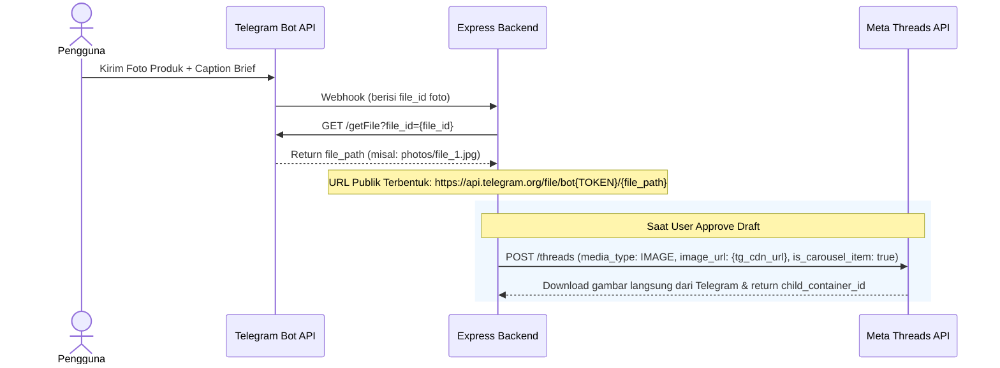

# 🛍️ Arsitektur Lengkap: Threads Affiliate & Product Promotion Engine

## 1. 📌 Ringkasan Konsep Baru
Project **Kavv AI** bertransformasi dari bot edukasi teknologi menjadi **Universal Affiliate & Social Commerce Automation Bot** untuk Meta Threads.

Bot ini berfungsi sebagai asisten konten affiliate yang dapat mempromosikan **kategori produk apa pun** (misal: barang anak kost, perlengkapan outdoor/mendaki, aksesoris/modifikasi motor, perlengkapan meja kerja, beauty, fashion, dll) dengan formula copywriting konversi tinggi berbasis 3-Part Threads:
* **Thread #1 (The Hook):** Menangkap perhatian calon pembeli lewat masalah sehari-hari (*pain point*) atau situasi yang relate, tanpa hard-selling.
* **Thread #2 (Value & Solution):** Mengulas produk sebagai solusi nyata, menonjolkan fitur kunci, kemudahan pakai, dan alasan kenapa barang ini *worth it*.
* **Thread #3 (Action, Links & Carousel Media):** Call to action yang persuasif, daftar link affiliate (Shopee, TikTok Shop, Tokopedia), dan **Carousel Slider Foto Produk** (1–10 foto).

---

## 2. 🧠 Universal Copywriting Engine (Prompting)

### A. Adaptasi Niche Otomatis (Dynamic Category Persona)
AI (Gemini 2.5 Flash) tidak dikunci pada satu niche saja. Prompt dirancang agar AI secara mandiri mengenali niche produk dari brief, lalu mengadopsi kosakata, gaya bahasa, dan keresahan audiens yang sesuai:

| Kategori Produk | Keresahan / Pain Point Utama | Slang & Kosakata Niche |
| :--- | :--- | :--- |
| **Barang Anak Kost** | Kamar sempit, cucian numpuk, listrik jeglek, dompet akhir bulan | *worth it, hemat space, listrik aman, ga ribet* |
| **Outdoor / Hiking** | Carrier berat, tenda bocor, kedinginan di puncak, makan tempat | *ultralight, anti-badai, packing ringkas, safety first* |
| **Otomotif / Motor** | Look standar, aki tekor, modif norak, kabel bodi dipotong | *look ganteng, Plug and Play (PnP), cut-off rapi, presisi* |
| **Desk Setup / Gadget** | Meja berantakan, kabel semrawut, leher pegal pas kerja | *cable management, ergonomis, aesthetic setup, mood booster* |

### B. Formula Copywriting 3-Part (PAS + AIDA)
1. **Thread #1 (Problem / Hook):**
   - Wajib memicu rasa penasaran (*curiosity gap*) atau validasi emosional.
   - Contoh: *"Buat anak kost an ini beneran worth it banget sih... ga perlu lagi capek nyuci manual tapi kamar tetep lega 😭🧵👇"*
2. **Thread #2 (Agitate & Solution / Main Content):**
   - Menjelaskan nama produk, fungsi utama, spesifikasi esensial, dan benefit praktis (misal: watt kecil, bisa dilipat, tahan air).
   - Menghitung perbandingan ekonomis (*"jauh lebih hemat dibanding..."*).
3. **Thread #3 (Call to Action + Link + Foto):**
   - Memberi urgensi (diskon, gratis ongkir, stok promo).
   - Menata link affiliate dengan rapi per platform:
     - 🛒 Shopee: `[URL]`
     - 🎵 TikTok Shop: `[URL]`
     - 🟢 Tokopedia: `[URL]`
   - Disertai multiple image carousel dari produk terkait.

### C. Aturan Mutlak Karakter (Hard Constraint)
* Setiap part **STRICTLY $\le$ 500 karakter** (batasan mutlak Meta Threads).
* Gaya bahasa: Bahasa Indonesia kasual, antusias, jujur seperti review pribadi pengguna asli.

---

## 3. 🖼️ Teknis Gambar: Pengambilan dari Telegram & Upload ke Threads

### A. Alur Ekstraksi Gambar dari Telegram (Zero-Setup CDN)
Pengguna tidak perlu menyiapkan cloud storage eksternal. Kita memanfaatkan CDN publik Telegram:


### B. Alur Carousel di Meta Threads API (Khusus Thread #3)
Meta Threads mendukung slider multi-foto (hingga 10 foto) via Carousel Container:

1. **Step 1 - Buat Container untuk Masing-Masing Gambar:**
   ```http
   POST https://graph.threads.net/v1.0/{threads-user-id}/threads
   Params:
     media_type: IMAGE
     image_url: https://api.telegram.org/file/bot.../foto1.jpg
     is_carousel_item: true
     access_token: {THREADS_TOKEN}
   ```
   *(Ulangi untuk foto ke-2, ke-3, dst. Menghasilkan array `[child_id_1, child_id_2, ...]`)*.

2. **Step 2 - Tunggu Status Item Selesai (`FINISHED`):**
   Memakai helper `waitForContainerFinished` untuk memastikan seluruh item gambar siap digabungkan.

3. **Step 3 - Buat Parent Container (Carousel):**
   ```http
   POST https://graph.threads.net/v1.0/{threads-user-id}/threads
   Params:
     media_type: CAROUSEL
     children: child_id_1,child_id_2,child_id_3
     text: "Isi Teks Thread #3 (CTA & Link Affiliate)"
     reply_to_id: {live_post_id_thread_2}
     access_token: {THREADS_TOKEN}
   ```

4. **Step 4 - Publish Carousel:**
   ```http
   POST https://graph.threads.net/v1.0/{threads-user-id}/threads_publish
   Params:
     creation_id: {parent_carousel_id}
     access_token: {THREADS_TOKEN}
   ```

---

## 4. 🗄️ Struktur Database Baru (Cloud Firestore: `drafts`)

Setiap dokumen draft affiliate di Firestore akan memiliki skema berikut:

```typescript
interface AffiliateLink {
  platform: "shopee" | "tiktok" | "tokopedia" | "other";
  url: string;
}

interface ThreadPart {
  part: number;                    // 1, 2, atau 3
  type: "HOOK" | "MAIN_CONTENT" | "CTA_AND_LINKS";
  text: string;                    // Teks thread (maksimal 500 karakter)
  charCount: number;
  mediaType: "TEXT" | "IMAGE" | "CAROUSEL";
  threadsPostId?: string;          // ID postingan Threads setelah live
}

interface AffiliateDraftDocument {
  productName: string;             // Nama produk yang diidentifikasi AI
  category: string;                // Kategori (misal: "Otomotif", "Anak Kost")
  imageUrls: string[];             // Array URL publik gambar (dari Telegram / input)
  affiliateLinks: AffiliateLink[]; // Daftar link pembelian
  threads: ThreadPart[];           // Selalu berisi tepat 3 parts
  status: "pending" | "publishing" | "published" | "failed";
  rootPostId?: string;             // ID Thread #1 di Threads
  createdAt: FirebaseFirestore.Timestamp;
  updatedAt: FirebaseFirestore.Timestamp;
  publishedAt?: FirebaseFirestore.Timestamp;
  errorMessage?: string;
}
```

---

## 5. 📱 Pengalaman Pengguna (Telegram UX)

### Format Input yang Didukung:
1. **Input Foto + Caption (Utama):**
   Pengguna mengirim 1–4 foto produk ke Telegram, dengan caption:
   ```text
   Mesin cuci mini portable lipat anak kost. Watt 36W, muat baju harian.
   Shopee: https://s.shopee.co.id/xxx
   TikTok: https://vt.tiktok.com/xxx
   ```
2. **Input Teks Saja (URL Gambar):**
   Jika tidak mengirim foto langsung, pengguna bisa mencantumkan link gambar di pesan teksnya:
   ```text
   Produk: Tenda Camping Ultralight
   Link Beli: https://s.shopee.co.id/xxx
   Gambar: https://domain.com/foto1.jpg, https://domain.com/foto2.jpg
   ```

### Format Preview di Telegram:
Bot membalas dengan pratinjau lengkap dan tombol persetujuan:
```text
🛍️ *DRAFT AFFILIATE THREADS: Mesin Cuci Mini Portable*
🏷️ *Kategori:* Home Appliances / Anak Kost
🖼️ *Lampiran:* 3 Gambar (Siap jadi Carousel di Part 3)

━━━━━━━━━━━━━━━━━━━
*[1/3] HOOK (365 chars)*
Buat anak kostan ini bener-bener definisi life changer sih! 😭
Capek banget tiap malam masih harus ngucek baju pake tangan di kamar mandi sempit? Kamar ga ada space buat mesin cuci biasa?
Untung nemu solusi ini, ga perlu capek nyuci manual tapi kamar tetep lega! 🧵👇

━━━━━━━━━━━━━━━━━━━
*[2/3] MAIN CONTENT (415 chars)*
Jadi ini tuh Mesin Cuci Mini Lipat Portable! ✨
Bisa dilipat jadi seukuran ember kecil, tinggal selipin di pojokan lemari pas beres.
Kelebihannya:
✅ Daya cuma 36 Watt (listrik kost aman)
✅ Ada tabung pengering (drain basket)
✅ Pas buat baju harian & underwear
Harganya 100-200 ribuan, jauh lebih hemat dari laundry kiloan! 🧺

━━━━━━━━━━━━━━━━━━━
*[3/3] CTA & LINKS + CAROUSEL (380 chars)*
Yang mau samaan, mumpung lagi ada voucher gratis ongkir & diskon kilat, link tokonya udah aku spill di bawah ya:
🛒 Shopee: https://s.shopee.co.id/xxx
🎵 TikTok: https://vt.tiktok.com/xxx
Yuk checkout sekarang sebelum promonya hangus! 📦💨

[ ✅ Approve & Upload to Threads ]
```

---

## 6. 🚀 Rantai Eksekusi Publishing (Step-by-Step)

Ketika tombol **`[ ✅ Approve & Upload to Threads ]`** ditekan:

1. **Upload Part 1 (Hook):**
   - Type: `TEXT`
   - Dipublikasikan sebagai Root Post.
   - Mencatat `rootPostId`.

2. **Upload Part 2 (Main Content):**
   - Type: `TEXT`
   - Dipublikasikan dengan `reply_to_id = rootPostId`.
   - Mencatat `part2PostId`.

3. **Upload Part 3 (CTA & Carousel):**
   - Jika terdapat $\ge$ 2 gambar:
     - Mengunggah tiap gambar dengan `is_carousel_item = true`.
     - Menunggu polling item hingga `FINISHED`.
     - Mengunggah `CAROUSEL` container dengan `text = teks_part_3` dan `reply_to_id = part2PostId`.
     - Menunggu polling carousel hingga `FINISHED`.
     - Mempublikasikan carousel via `threads_publish`.
   - Jika hanya 1 gambar:
     - Mengunggah `IMAGE` container dengan `text = teks_part_3` dan `reply_to_id = part2PostId`.
     - Mempublikasikan container.
   - Jika tanpa gambar:
     - Mengunggah `TEXT` container biasa dengan `reply_to_id = part2PostId`.

4. **Pembaruan Status & Notifikasi:**
   - Database Firestore diperbarui menjadi `status: "published"`.
   - Bot Telegram mengirim pesan konfirmasi sukses beserta link langsung ke postingan Threads.
