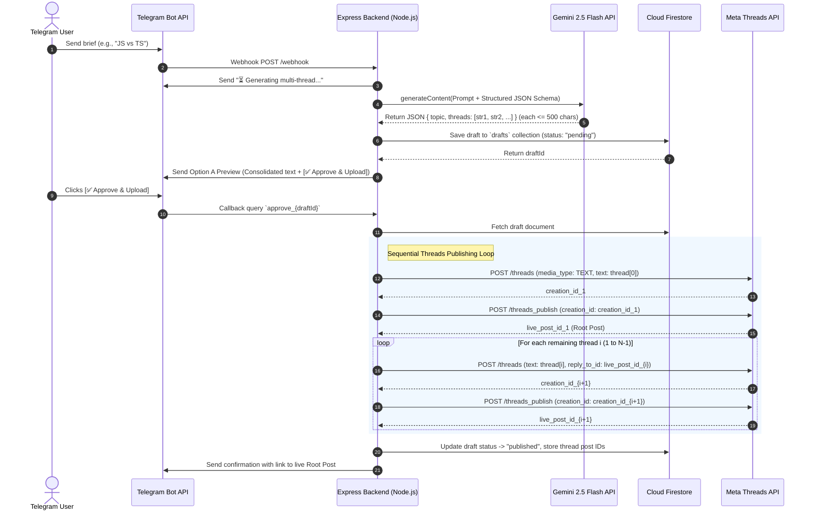

# 🧵 Architecture Design: Multi-Thread Auto-Publishing Engine

## 1. 📌 Executive Overview
This document outlines the architecture, data structures, and operational flow for upgrading **kavv AI** from single-post generation to **Multi-Thread (Threadstorm) Content Automation**.

The system enables users to submit a short brief via Telegram, uses **Google Gemini 2.5 Flash** with structured output to generate an interconnected series of posts (up to 10 threads, each $\le$ 500 characters) in a relatable Indonesian tech tone, previews the thread in a single Telegram message, and sequentially publishes the thread chain to Meta Threads upon human approval.

---

## 2. 🏗️ High-Level System Architecture



---

## 3. 🗄️ Database Schema (Cloud Firestore)

### Comparison: Old Schema vs. New Multi-Thread Schema

#### ❌ Old Schema (Single Post)
```json
{
  "content": "A single string of post content...",
  "status": "pending",
  "createdAt": "2026-08-31T07:00:00.000Z",
  "threadsPostId": "1803291823912389"
}
```

#### ✅ New Multi-Thread Schema (`drafts` collection)
Document ID: `Auto-Generated Firestore Doc ID` (e.g. `k8sD91ja8fA`)

```typescript
interface ThreadItem {
  index: number;            // 1-based index (1 to N)
  text: string;             // Content of this specific thread part (max 500 chars)
  charCount: number;        // Character count for audit
  threadsPostId?: string;   // Meta Threads live post ID (populated after publishing)
}

interface DraftDocument {
  topic: string;            // Short topic title generated by AI
  totalThreads: number;     // Total number of thread parts (e.g. 5, max 10)
  threads: ThreadItem[];    // Array of thread items in chronological order
  status: "pending" | "publishing" | "published" | "failed";
  rootPostId?: string;      // The Threads Post ID of Thread #1 (the root post)
  errorMessage?: string;    // Recorded if publishing failed midway
  createdAt: FirebaseFirestore.Timestamp;
  updatedAt: FirebaseFirestore.Timestamp;
  publishedAt?: FirebaseFirestore.Timestamp;
}
```

---

## 4. 🧠 Gemini AI Prompt & Structured Output Design

### Response Schema Specification
We will use Gemini's `responseSchema` to force structured JSON responses so the model can never output markdown wrapping or unstructured text that breaks parser logic.

```javascript
const schema = {
  type: "OBJECT",
  properties: {
    topic: { 
      type: "STRING", 
      description: "Short, catchy topic title" 
    },
    threads: {
      type: "ARRAY",
      description: "Sequential list of thread posts (maximum 10 parts). Each part MUST be strictly under 500 characters.",
      items: {
        type: "STRING",
        description: "Content for one thread part, strictly under 500 characters."
      }
    }
  },
  required: ["topic", "threads"]
};
```

### Persona & Style Guidelines (System Instruction)
* **Tone & Persona:** Indonesian tech-savvy developer casual ("*bahasa santai/relatable*", using tech slangs naturally like *vibe coder*, *over-engineering*, *bahasa bayi*, *open discuss kuyy/yukk*).
* **Language:** Indonesian primarily, naturally mixing English technical terms (like *authentication*, *clean code*, *runtime*, *maintainability*).
* **Thread Count:** Dynamically determined based on depth of topic, between **3 and 10 threads**.
* **Structure:**
  * **Thread #1 (Hook):** Relatable developer dilemma, punchy dialogue, or interesting scenario.
  * **Thread #2 – #N-1 (Deep Dive):** Explanations, clear definitions, comparisons, step-by-step logic flows (`User -> Server -> DB`), or concise code scenarios.
  * **Thread #N (Closing & CTA):** Practical advice/reflection + Open discussion invitation (*"Menurut kalian gimana? Reply di bawah yukk, kita open discuss👇"*).
* **Hard Rule:** Strict maximum of 500 characters per individual thread post.

---

## 5. 📱 Telegram UX (Option A - Consolidated Preview)

When a brief is processed, Telegram receives a single formatted message:

```text
🧵 AI Multi-Thread Draft: JavaScript vs TypeScript
📊 Total: 5 parts

━━━━━━━━━━━━━━━━━━━
[1/5] (245 chars)
Kalian pernah gaa sih kepikiran kenapa TypeScript makin hari makin rame dipake, padahal nulis JavaScript murni jauh lebih cepet dan sat-set? 😭
Logic-nya sama, tapi pas project makin gede, kok JS mulai bikin overthinking?
Let's break down bedanya! 🧵👇

━━━━━━━━━━━━━━━━━━━
[2/5] (310 chars)
Bedanya apa sih sebenernya?
JS itu Dynamic Typing: variabel bebas berubah tipe sesuka hati pas runtime.
TS itu Static Typing: tipe data dicek saat compile time sebelum kode jalan.
Singkatnya: JS ngebiarin kamu nabrak tembok pas runtime, TS masang rambu peringatan sebelum kamu jalan.

━━━━━━━━━━━━━━━━━━━
... (parts 3 to 5)

[ ✅ Approve & Upload to Threads ]
```

* Clicking **[ ✅ Approve & Upload ]** triggers the callback `approve_{draftId}`.

---

## 6. 🚀 Meta Threads Sequential Publishing Algorithm

```javascript
// Step 1: Mark draft as 'publishing'
await db.collection("drafts").doc(draftId).update({ status: "publishing" });

let previousPostId = null;
const publishedThreadItems = [];

for (let i = 0; i < draft.threads.length; i++) {
  const item = draft.threads[i];
  
  // A. Create Media Container
  const containerParams = {
    media_type: "TEXT",
    text: item.text,
    access_token: process.env.THREADS_TOKEN,
  };
  
  // If not the first post, chain it to the previous post
  if (previousPostId) {
    containerParams.reply_to_id = previousPostId;
  }
  
  const containerRes = await axios.post(
    `https://graph.threads.net/v1.0/${process.env.THREADS_USER_ID}/threads`,
    null,
    { params: containerParams }
  );
  const creationId = containerRes.data.id;

  // B. Publish Media Container
  const publishRes = await axios.post(
    `https://graph.threads.net/v1.0/${process.env.THREADS_USER_ID}/threads_publish`,
    null,
    {
      params: {
        creation_id: creationId,
        access_token: process.env.THREADS_TOKEN,
      },
    }
  );
  
  const livePostId = publishRes.data.id;
  previousPostId = livePostId; // Next thread will reply to this post

  publishedThreadItems.push({
    ...item,
    threadsPostId: livePostId,
  });

  // Short pause (500ms) to respect Meta rate limits
  await new Promise((resolve) => setTimeout(resolve, 500));
}

// Step 2: Mark draft as 'published' and save all post IDs
await db.collection("drafts").doc(draftId).update({
  status: "published",
  rootPostId: publishedThreadItems[0].threadsPostId,
  threads: publishedThreadItems,
  publishedAt: admin.firestore.FieldValue.serverTimestamp(),
});
```

---

## 7. 🛡️ Error Handling & Edge Cases
1. **Telegram 4096 Character Limit:**
   If a 10-thread preview exceeds Telegram's 4096 character limit for a single message, the bot will intelligently chunk the preview into 2 safe messages and attach the inline button to the final message.
2. **Partial Threads Failure:**
   If publishing fails at Thread #4 out of 5, the Firestore document is updated with `status: "failed"` and logs the already-published IDs so state is preserved.
3. **Character Length Safety Guard:**
   Even though Gemini is instructed with a 500-character constraint, a backend validation slice ensures no individual thread text exceeds 500 characters before sending to Threads API.
