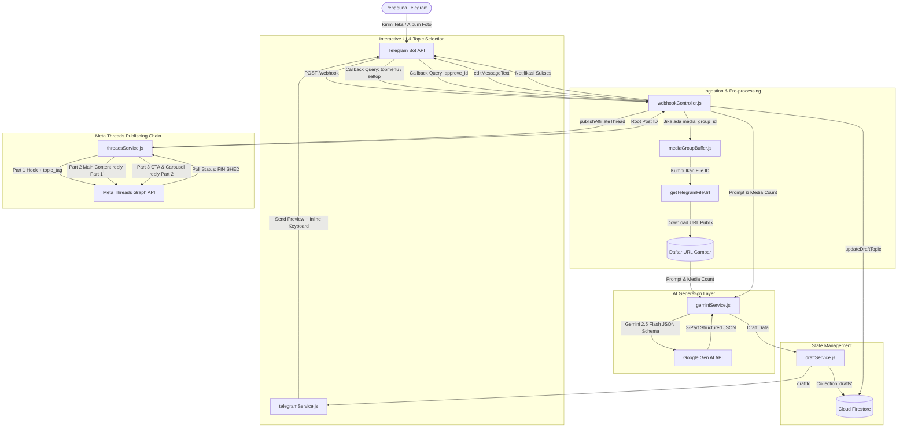
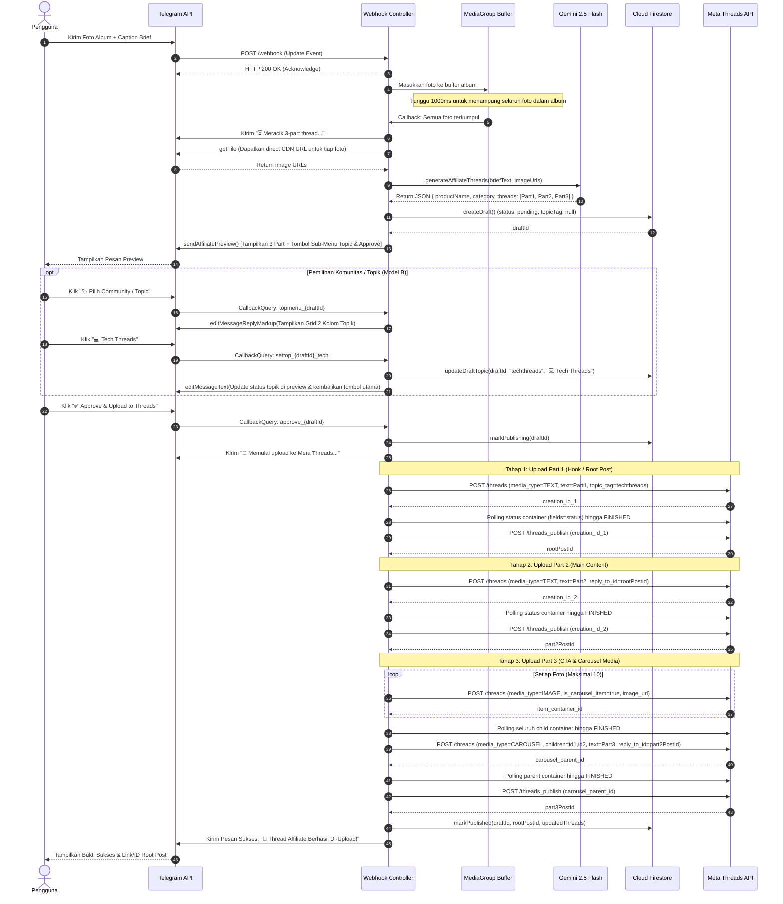

# 🏗️ Arsitektur dan Alur Teknis (End-to-End Workflow)

Dokumen ini menyajikan panduan arsitektur sistem dan alur teknis komprehensif dari aplikasi **Threads Content Creation & Affiliate Bot**, mulai dari saat pengguna mengirimkan brief produk di Telegram hingga postingan 3 bagian berhasil terbit di Meta Threads.

---

## 📑 Daftar Isi

1. [Gambaran Umum Arsitektur](#1-gambaran-umum-arsitektur)
2. [Diagram Alur End-to-End (Sequence Diagram)](#2-diagram-alur-end-to-end-sequence-diagram)
3. [Tahapan Alur Teknis Secara Rinci](#3-tahapan-alur-teknis-secara-rinci)
   - [Tahap 1: Ingestion Brief & Penanganan Album Foto (Media Group Buffer)](#tahap-1-ingestion-brief--penanganan-album-foto-media-group-buffer)
   - [Tahap 2: Generasi Konten Terstruktur dengan Gemini 2.5 Flash](#tahap-2-generasi-konten-terstruktur-dengan-gemini-25-flash)
   - [Tahap 3: Persistensi Draft di Firestore](#tahap-3-persistensi-draft-di-firestore)
   - [Tahap 4: Interaksi Telegram & Pemilihan Komunitas/Topik (Model B)](#tahap-4-interaksi-telegram--pemilihan-komunitastopik-model-b)
   - [Tahap 5: Penerbitan Berantai ke Meta Threads Graph API](#tahap-5-penerbitan-berantai-ke-meta-threads-graph-api)
4. [Skema Data Dokumen Firestore](#4-skema-data-dokumen-firestore)
5. [Mekanisme Ketahanan & Penanganan Error (Resilience & Error Handling)](#5-mekanisme-ketahanan--penanganan-error-resilience--error-handling)

---

## 1. Gambaran Umum Arsitektur

Arsitektur aplikasi dibangun dengan pendekatan modular berbasis **Event-Driven Webhook** dan **Micro-Services Layers**:



---

## 2. Diagram Alur End-to-End (Sequence Diagram)

Diagram berikut mengilustrasikan urutan komunikasi antar komponen sistem dari awal hingga akhir:



---

## 3. Tahapan Alur Teknis Secara Rinci

### Tahap 1: Ingestion Brief & Penanganan Album Foto (Media Group Buffer)
1. **Penerimaan Update Webhook:** Telegram mengirimkan payload JSON ke endpoint `/webhook` server Express.js.
2. **Buffer Album Foto:** Telegram mengirim setiap foto dalam satu album sebagai pesan HTTP POST terpisah dengan atribut `media_group_id` yang sama.
   - Modul [`mediaGroupBuffer.js`](file:///d:/DOT%20Indonesia/Project/threads-bot/src/utils/mediaGroupBuffer.js) menahan proses selama 1000 milidetik (*debounce*) untuk mengumpulkan seluruh `file_id` foto sebelum memanggil generator AI.
3. **Resolusi URL CDN:** Setiap `file_id` diubah menjadi tautan publik langsung menggunakan endpoint Telegram `getFile` (`https://api.telegram.org/file/bot<TOKEN>/<FILE_PATH>`).

---

### Tahap 2: Generasi Konten Terstruktur dengan Gemini 2.5 Flash
1. **Dynamic Prompting:** Modul [`affiliatePrompt.js`](file:///d:/DOT%20Indonesia/Project/threads-bot/src/prompts/affiliatePrompt.js) meracik instruksi sistem ke Google Gemini.
2. **Formula 3 Bagian (High-Conversion Affiliate Copywriting):**
   - **Part 1 (Hook):** Membuka keresahan (*problem statement*) atau fakta menarik tanpa langsung menyebut merek.
   - **Part 2 (Main Content):** Review objektif, *spill* kelebihan utama, spesifikasi penting, dan alasan kepemilikan.
   - **Part 3 (CTA & Affiliate Links):** Ajakan membeli yang mendesak (*scarcity/urgency*), panduan checkout, dan etalase link produk.
3. **Enforcement Skema Ketat:** Parameter `responseSchema` (JSON) menjamin AI mengembalikan format terstruktur yang divalidasi dengan batas maksimal 500 karakter per bagian.

---

### Tahap 3: Persistensi Draft di Firestore
1. Setelah AI berhasil menghasilkan output, dokumen baru disimpan ke Cloud Firestore pada *collection* `drafts`.
2. Status awal disetel ke `pending`, dengan field `topicTag: null` dan `topicLabel: null`.
3. Dokumen ini menjadi sumber kebenaran (*single source of truth*) yang dapat diubah selama proses review di Telegram.

---

### Tahap 4: Interaksi Telegram & Pemilihan Komunitas/Topik (Model B)
1. **Pesan Preview:** Pengguna menerima pesan rapi berisi preview teks ketiga bagian dan tombol inline:
   - `[ 🏷️ Pilih Community / Topic ]`
   - `[ ✅ Approve & Upload to Threads ]`
2. **Transisi Sub-Menu (Model B):**
   - Mengklik tombol topic mengubah keyboard inline menjadi daftar komunitas 2 kolom (`src/config/topics.js`).
   - Pilihan yang tersedia:
     - 💻 Tech Threads (`techthreads`)
     - 🤖 AI Threads (`aithreads`)
     - 🛍️ Racun Shopee (`racunshopee`)
     - 👗 Fashion Threads (`fashionthreads`)
     - 🎮 Gaming Threads (`gamingthreads`)
     - 💄 Beauty Threads (`beautythreads`)
     - 📚 Book Threads (`bookthreads`)
     - 🐱 Cats of Threads (`catsofthreads`)
     - 🌐 Tanpa Topic (Default)
     - ⬅️ Batal / Kembali ke Preview
3. **Atomic Update:**
   - Memilih salah satu topik memperbarui field `topicTag` & `topicLabel` pada dokumen Firestore via `draftService.updateDraftTopic()`.
   - Pesan Telegram diperbarui secara langsung (`editMessageText`) tanpa mengirim pesan baru.

---

### Tahap 5: Penerbitan Berantai ke Meta Threads Graph API
Saat tombol **Approve** diklik, modul [`threadsService.js`](file:///d:/DOT%20Indonesia/Project/threads-bot/src/services/threadsService.js) mengeksekusi alur 3-part upload:

1. **Part 1 (Root Post / Hook):**
   - Membuat container teks via `POST /{user_id}/threads`.
   - Jika draft memiliki `topicTag`, parameter `topic_tag` resmi dari Meta disematkan pada request ini.
   - Sistem melakukan polling status container hingga `FINISHED`.
   - Menerbitkan container via `POST /{user_id}/threads_publish`. Menyimpan `rootPostId`.
2. **Part 2 (Main Content Reply):**
   - Dibuat dengan parameter `reply_to_id: rootPostId`.
   - Diposting setelah status container `FINISHED`. Menyimpan `part2PostId`.
3. **Part 3 (CTA & Carousel Slider Media):**
   - Jika terdapat $> 1$ foto (hingga 10 foto):
     1. Membuat container untuk tiap foto dengan `media_type: "IMAGE"` dan `is_carousel_item: true`.
     2. Menunggu seluruh item anak berstatus `FINISHED`.
     3. Membuat parent container dengan `media_type: "CAROUSEL"`, `children: "<id1>,<id2>,..."`, teks CTA, dan `reply_to_id: part2PostId`.
     4. Menerbitkan carousel parent container.
   - Jika hanya 1 foto: Dibuat sebagai container `IMAGE` tunggal dengan teks CTA.
   - Jika tanpa foto: Dibuat sebagai container `TEXT` tunggal.
4. **Finalisasi & Laporan:**
   - Status draft di Firestore diubah menjadi `published`.
   - Bot Telegram mengirimkan laporan sukses beserta ID Root Post Threads.

---

## 4. Skema Data Dokumen Firestore

Setiap draft disimpan di koleksi `drafts` dengan struktur dokumen sebagai berikut:

```json
{
  "productName": "TWS Bluetooth X1 ANC",
  "category": "Audio & Gadget",
  "status": "published", 
  "topicTag": "techthreads",
  "topicLabel": "💻 Tech Threads",
  "rootPostId": "18042938102938491",
  "imageUrls": [
    "https://api.telegram.org/file/bot.../photo1.jpg",
    "https://api.telegram.org/file/bot.../photo2.jpg"
  ],
  "threads": [
    {
      "part": 1,
      "type": "HOOK",
      "text": "Sering emosi gara-gara TWS murah yang suaranya mendem?...",
      "charCount": 240,
      "mediaType": "TEXT",
      "threadsPostId": "18042938102938491"
    },
    {
      "part": 2,
      "type": "MAIN_CONTENT",
      "text": "Kenalin TWS X1. Udah dilengkapi fitur Active Noise Cancelling...",
      "charCount": 380,
      "mediaType": "TEXT",
      "threadsPostId": "18042938102938492"
    },
    {
      "part": 3,
      "type": "CTA_AND_LINKS",
      "text": "Khusus hari ini lagi ada diskon 40% di Shopee! Cek di sini 👇...",
      "charCount": 210,
      "mediaType": "CAROUSEL",
      "threadsPostId": "18042938102938493"
    }
  ],
  "createdAt": "2026-09-10T06:30:00.000Z",
  "updatedAt": "2026-09-10T06:30:45.000Z",
  "publishedAt": "2026-09-10T06:30:45.000Z"
}
```

### Transisi Status Draft (`status`):
- `pending`: Draft baru saja dibuat oleh AI dan sedang menunggu review/approval di Telegram.
- `publishing`: Pengguna telah mengklik Approve dan sistem sedang mengunggah ke Meta Threads. Mencegah duplikasi klik ganda.
- `published`: Semua 3 bagian thread berhasil diposting berurutan.
- `failed`: Terjadi kendala teknis pada Meta Threads API atau jaringan (disertai field `errorMessage`).

---

## 5. Mekanisme Ketahanan & Penanganan Error (Resilience & Error Handling)

1. **Penanganan Propagasi Asinkron Meta Threads (Subcode `4279009`):**
   - Media container Threads sering kali belum langsung terdaftar di server database Meta saat container creation ID baru dikembalikan.
   - Fungsi `publishContainerWithRetry()` memiliki mekanisme *exponential backoff retry* otomatis (hingga 5 kali percobaan) saat mendeteksi error `4279009` atau status `404` sementara.
2. **Polling Kesiapan Media (`waitForContainerFinished`):**
   - Container media gambar/carousel membutuhkan waktu untuk diunduh dan diproses oleh CDN Meta.
   - Sistem melakukan polling setiap 1.5 detik (hingga 8 percobaan) untuk memastikan status berubah menjadi `FINISHED` sebelum pemanggilan fungsi publish.
3. **Penyelamatan Karakter Khusus Telegram Markdown:**
   - Jika terjadi *parse error* pada Telegram akibat karakter format yang tidak seimbang di pesan review, helper `editMessageText` dan `sendAffiliatePreview` secara otomatis me-*fallback* pengiriman tanpa `parse_mode` agar pesan tetap tersampaikan dengan aman ke pengguna.
4. **Validasi Batasan Callback Telegram (< 64 Byte):**
   - Semua perintah callback query dipadatkan (`topmenu_{id}`, `settop_{id}_{tid}`, `clrtop_{id}`) sehingga ukurannya selalu berada di bawah batas maksimal 64 byte dari Telegram API.
